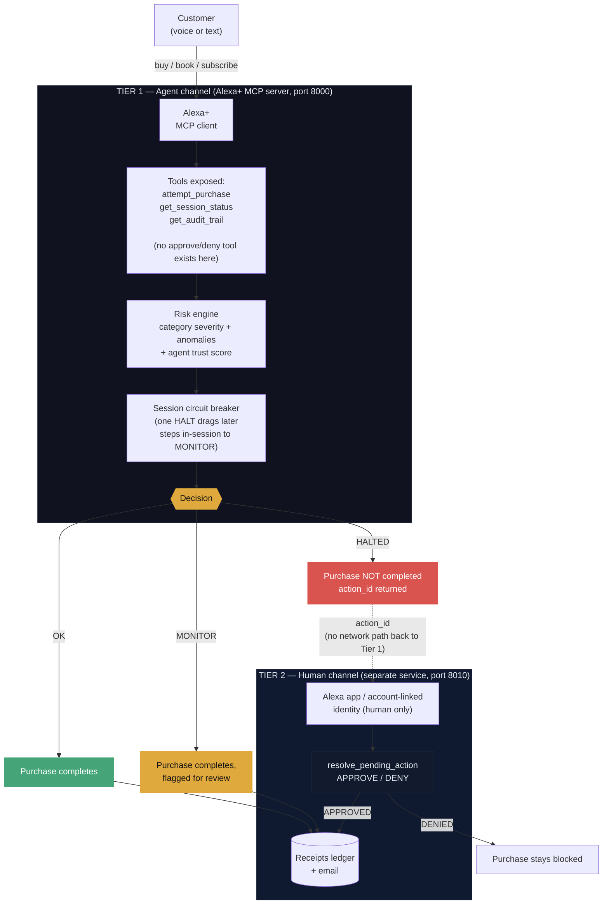

# Alguard — an Alexa+ Purchase Guard

An Alexa+ agent-trust layer for autonomous purchases. The risk architecture here is
ported from [Albugent](https://github.com/evaaliya/albugent_v2.0), a data-governance
engine we built previously that scores datasets for risk and halts anything above a
threshold pending human review -- categories and datasets became purchase attempts
and sessions, but the core rule carried over unchanged, built strictly on Amazon's
own MCP Toolkit for Alexa+ (developer.amazon.com/docs/alexaplus/add-ons/):

> **The system that requests a risky action is never the system that approves it.**

In Albugent this was: the LLM/agent can call `apply_patch` only through a UI button,
never as a tool call. Here it becomes: **the Alexa+ agent has an MCP tool to *attempt*
a purchase, but no tool to *approve* one it halted.**

## Built on Amazon's own tooling, not a generic MCP stack

This project follows the Alexa+ MCP QuickStart Guide and MCP Design Guide for Alexa+
end to end, not just "an MCP server that happens to work":

- **Transport & spec**: Streamable HTTP, MCP spec 2025-11-25+ (Alexa+ MCP Toolkit's
  hard technical requirement -- the legacy SSE transport is not accepted).
- **Onboarding**: `addon-package/addon.json` (this repo includes one, schema per the
  QuickStart Guide) + the **Alexa AI CLI** -- `alexa-ai configure`, then either the
  Add-on Agent Skill or `alexa-ai new mcp` / `alexa-ai deploy` manually. This is how
  the MCP server actually gets registered with Alexa+; it is not something you can
  fake with your own web server.
- **Tool design**: every tool below follows the Design Guide's "Tools, Schema, and
  Data Design" rules -- one tool per customer intent, a description stating when/why
  to call it and what it returns, and "declare only what you honor" (see the
  `agent_id` note below).
- **Testing**: the guide-prescribed path is "Test in the Web Simulator" after
  `alexa-ai deploy`. `demo/simulate_session.py` is a stand-in generic MCP client for
  local development before you have simulator access; `demo/test_logic_offline.py`
  exercises the decision pipeline with no MCP transport at all.

### A correction the Design Guide forced

The guide is explicit: *"Declare only what you honor... A parameter the model can
send but your server silently ignores produces confidently wrong answers, since the
model trusts the schema and fills arguments based on it."* An earlier version of this
project had `attempt_purchase(agent_id, ...)` -- but `agent_id` isn't something Alexa+
can honestly know; it would have to invent it, and a bad-faith caller could pass any
agent_id it wants, quietly defeating the trust-score check in `risk_evaluator.py`.
Caller identity now comes from `mcp_server/utils/auth_context.py`, which reads it off
the authenticated request context (via FastMCP's `Context`), not from an
LLM-suppliable tool argument. Real identity verification needs Account Linking (OAuth
2.1 + PKCE S256) configured in the Amazon developer console -- see "Not yet done"
below.

### Corrections the Functional Requirements forced

Certification review (developer.amazon.com/docs/alexaplus/add-ons/functional-requirements.html)
surfaces a checklist, not just guidance. A few of its rules changed actual code here:

- **#13, MCP Tool Validation** -- *"Include common synonyms, abbreviations, and
  alternate spellings in your tool parameter descriptions and enums so variants
  resolve correctly."* `category` used to be free text matched by substring
  (`"gift_card" in category.lower()`), which would silently miss `"gift card"` (a
  space instead of an underscore) and quietly downgrade a High-severity purchase to
  Low. Fixed by making `category` a closed `Literal[...]` enum in the tool schema
  (`CATEGORY_VALUES` in `category_risk.py`) -- there's no longer a spelling for the
  model to get wrong, and severity lookup is now an exact match, not a guess.
- **#13** -- *"use the MCP error contract (isError: true or JSON-RPC errors) for
  failures rather than returning malformed payloads"* and *"gracefully handle
  unexpected or invalid parameters."* `get_audit_trail` used to return
  `{"error": "not found"}` as an ordinary successful result; it now raises, so FastMCP
  produces a proper MCP error response. `attempt_purchase` now validates `amount`,
  `item`, and `merchant` before doing anything, raising instead of silently scoring
  garbage input.
- **#8, Transaction Flow** -- *"Detect and prevent duplicate transactions"* and
  *"Deliver a receipt via at least one channel... after payment."* Neither existed
  before. `session_profiler.py` now flags a `duplicate_attempt` (same item/merchant/
  amount attempted twice in one session), which forces at least MONITOR through the
  existing anomaly-flag path. `mcp_server/utils/receipts.py` is a stub call site for
  the required post-purchase receipt -- it logs instead of actually sending one; wire
  in a real channel (transactional email, SMS, Alexa notifications) before
  certification.
- **#8** -- *"Require explicit confirmation with key details before any
  high-consequence action (payment, cancellation, deletion)"* is, almost word for
  word, the reason this whole project's HALT/Tier-2 design exists. Worth knowing this
  isn't just our own risk-management preference -- it's a certification requirement
  independent of this project.

## Two trust tiers

- **Tier 1 -- `mcp_server/`**: the MCP server Alexa+ actually talks to (Streamable
  HTTP). Exposes `attempt_purchase`, `get_session_status`, `get_audit_trail`. Nothing
  else.
- **Tier 2 -- `web_api/`**: a separate FastAPI service reachable only through an
  authenticated end-user channel (the Alexa companion app, in a real deployment). The
  only place a HALTED action can be approved or denied. Not an MCP tool, not listed in
  `addon.json`'s `integrations`, not reachable from the agent.

This maps onto something Amazon already ships: the Payments for Alexa+ guide
describes an Amazon Wallet consent flow where the customer "sees a message to scan a
QR code or check notifications in the Alexa app" before a charge completes -- the same
shape as our HALTED -> Tier 2 approval step. Wiring `resolve_pending_action` to an
actual charge (via `ChargePermissionId` / a partner-wallet checkout API) is future
work, described in "Implement Checkout Endpoints" -- out of scope for this MVP.

## Architecture



The dashed arrow from `Blocked` to the human channel is deliberate: it's a dashed
line, not a solid one, because there is no direct network path there -- only an
`action_id` the customer carries over to a completely separate service.

## Running it

### Local development / logic check (no Amazon account needed)

```bash
pip install -r requirements.txt
python demo/test_logic_offline.py        # decision pipeline, no transport involved
```

### Real MCP transport, generic client (before you have simulator access)

```bash
# terminal 1
python -m mcp_server.server        # Tier 1, Streamable HTTP, port 8000
# terminal 2
python -m web_api.resolve_action   # Tier 2, port 8010
# terminal 3
python demo/simulate_session.py
```

### The actual Alexa+ onboarding path

```bash
alexa-ai configure                 # LWA OAuth login, once
# expose mcp_server (port 8000) via a tunnel, e.g.:
cloudflared tunnel --url http://localhost:8000

# fill addon-package/addon.json: privacyPolicyUrl, termsOfUseUrl, mediaAssets,
# and integrations[0].config.endpoints.default.uri = your tunnel/deployed URL

alexa-ai deploy                    # registers the add-on, dev stage
# then: Test in the Web Simulator (developer.amazon.com/alexa/console/ask/addons)
```

## What's intentionally NOT built yet

- **A real OAuth authorization server**: `mcp_server/utils/auth_context.py` is now a
  real, working OAuth 2.1 resource-server token verifier (JWT + JWKS, via the MCP
  SDK's `TokenVerifier`/`AuthSettings`) -- point `OAUTH_JWKS_URL`, `OAUTH_ISSUER_URL`,
  `OAUTH_AUDIENCE` at any real authorization server (Auth0, Cognito, Okta...) and it
  validates real tokens. What's still missing is *running* that authorization
  server and registering Alexa's redirect URIs with it -- see "Enable real OAuth"
  below. Without those env vars set, the server runs with no auth at all (fine for
  local dev, not for certification). Also note: the MCP SDK adds a `WWW-Authenticate`
  header to 401 responses, which the Alexa+ Authentication checklist currently lists
  as "Not Supported Yet" on their side -- flagged in a code comment, not fixed, since
  it can't be tested against real Alexa+ without Private Preview access.
- Real merchant execution after a Tier 2 approval, and the actual Alexa+ Checkout API
  integration (`ChargePermissionId` / partner wallet, per "Implement Checkout
  Endpoints") -- stubbed with a comment in `apply_resolution.py`.

## Enable real OAuth (optional, for testing auth locally)

Point these env vars at any OAuth 2.1 authorization server before starting
`mcp_server.server` (a free Auth0 or Cognito test tenant works fine for this):

```bash
export OAUTH_JWKS_URL="https://your-auth-server.example.com/.well-known/jwks.json"
export OAUTH_ISSUER_URL="https://your-auth-server.example.com/"
export OAUTH_AUDIENCE="http://localhost:8000/mcp"
export OAUTH_REQUIRED_SCOPES="purchase"   # optional, space-separated
python -m mcp_server.server
```

`demo/simulate_session.py` doesn't send a Bearer token, so with auth enabled it will
get rejected -- that's the point (proves the auth actually rejects unauthenticated
callers). Leave the env vars unset to keep using the demo script as before.

## Enable real Bedrock explanations (optional, AWS Builder Mini Challenge)

By default, `explain.py`'s customer-facing explanation text is a deterministic
template -- no AWS call, no dependency on boto3 even being installed. Setting
`EXPLAIN_USE_BEDROCK=1` switches it to a real Amazon Bedrock Runtime call (the
Converse API, Amazon Nova by default) that phrases the same already-computed facts
as a sentence -- same principle as Albugent's `agent.py`: the model is given the
facts and explicitly told not to add anything beyond them; it never re-derives
`status` or `risk_score` itself.

```bash
export EXPLAIN_USE_BEDROCK=1
export AWS_REGION=us-east-1
export AWS_BEDROCK_MODEL_ID=amazon.nova-pro-v1:0   # or any Bedrock model your account can access
# uses the standard boto3 credential chain (env vars / ~/.aws/credentials / role)
python -m mcp_server.server
```

If the Bedrock call fails for any reason (no credentials, no model access, network
error, empty response), `explain.py` logs a warning and falls back to the
deterministic template automatically -- the customer never sees a raw error instead
of an explanation.

## View a delivered receipt

Every completed purchase (`OK`/`MONITOR`, or a `HALTED` one a human later approves)
writes a real receipt to `data/receipts_ledger.jsonl` and, if `SMTP_HOST` is
configured, also emails it. Read one back via the Tier 2 service:

```bash
curl http://127.0.0.1:8010/receipts/<action_id>
```